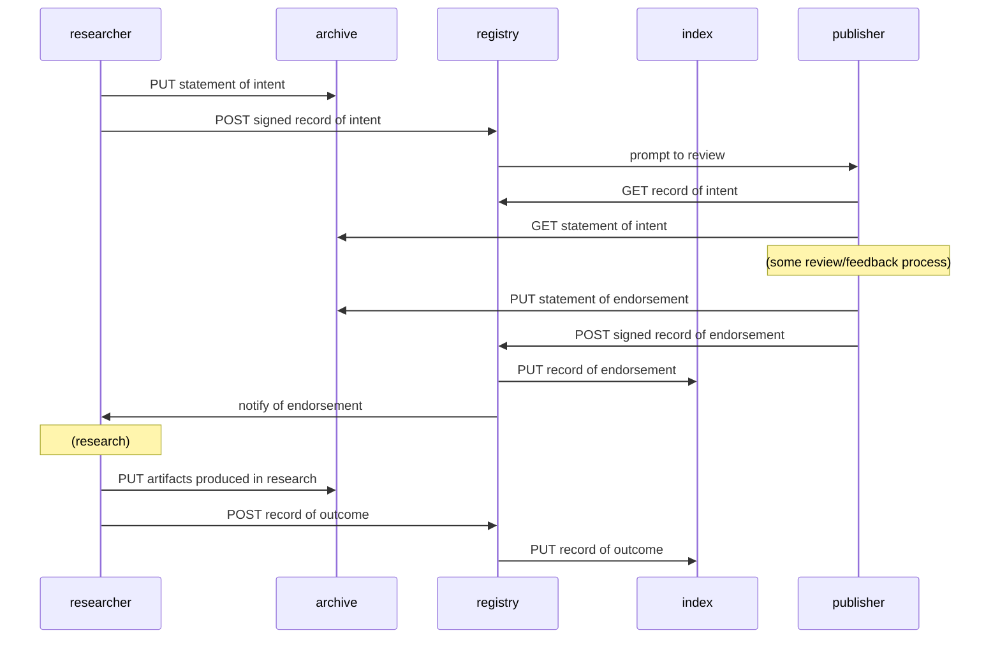

# rr
minimalist "registered report" system

## three related services

### archive
the archive stores arbitrary digital items, retrievable by checksum/hash.

### registry
the registry stores metadata records (including references
to archived items), retrievable by id.

### index
the index stores registry record ids, retrievable by metadata query.

## rr workflow
happy path:

## from what exists
- archive: content-addressed osfstorage
- registry: metadata records in share
- index: elasticsearch in share
